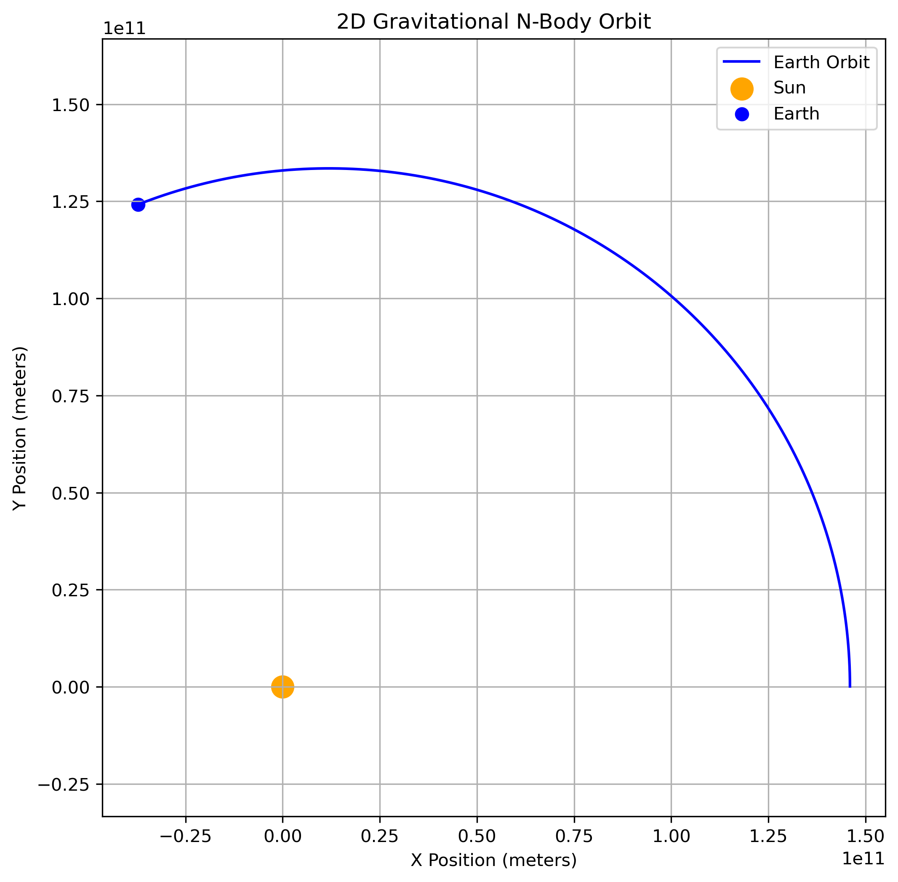

# n-body-gravitational-simulator
Object-oriented N-body gravitational physics engine built in Python.
# N-Body Gravitational Simulator

A procedural, object-oriented physics engine built in Python to simulate gravitational interactions between celestial bodies using Newton's Law of Universal Gravitation. 

## Architecture & Engineering
This engine was designed to prevent state-contamination during calculation loops. It utilizes a **two-pass update system**:
1. **Calculate State:** The system computes the net forces and predicts the next kinematic state for all bodies simultaneously.
2. **Apply State:** Positions and velocities are updated globally via `zip()` mapping, ensuring that a body moving early in the loop doesn't skew the gravitational calculations for bodies later in the loop.

## Physics Implementation

The simulation calculates gravitational force vectors in 3D space using NumPy arrays and SI Units (meters, kilograms, seconds). 

The force between any two bodies is determined by:

$$
F = G \frac{m_1 m_2}{r^2}
$$

To prevent mathematical singularities (division by zero) when bodies pass extremely close to one another, a distance softening parameter is applied during the vector normalization:

$$
r_{softened} = \sqrt{||\vec{r}||^2 + \epsilon^2}
$$

Markdown

